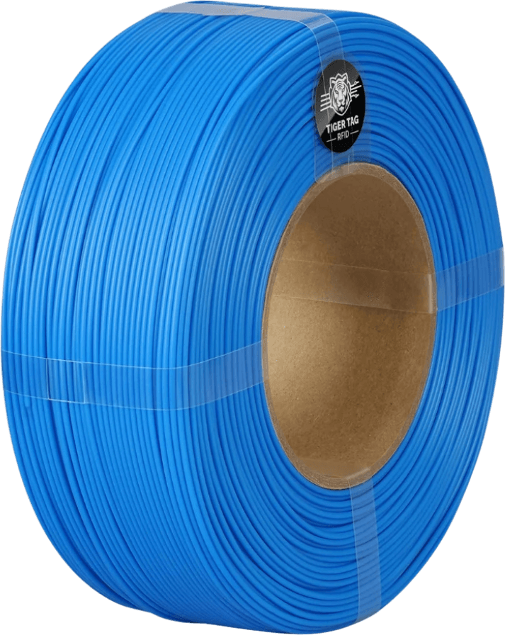
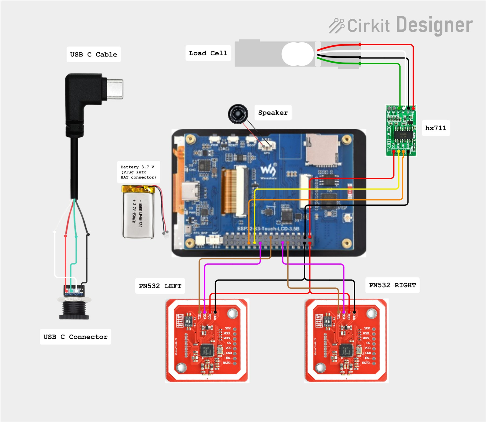
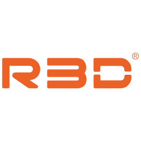
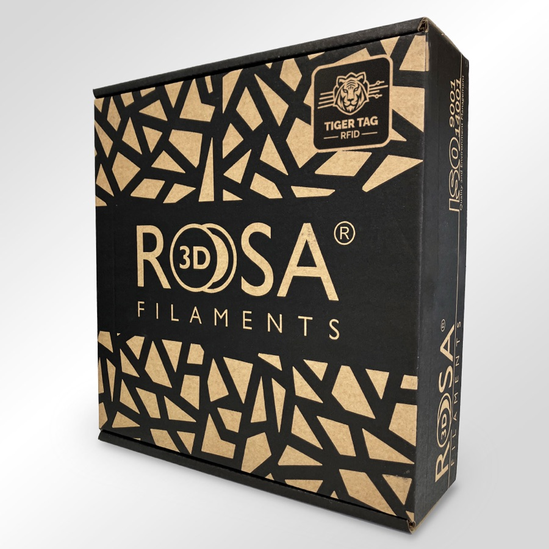
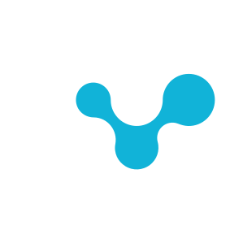
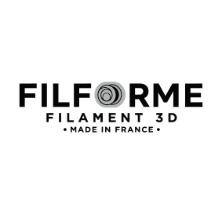

<p align="center">
  <picture>
    <source media="(prefers-color-scheme: dark)"  srcset="assets/logo-tigertag-head-dark.svg">
    <source media="(prefers-color-scheme: light)" srcset="assets/logo-tigertag-head.svg">
    
  </picture>
</p>

<h1 align="center">TigerScale V3</h1>

<p align="center">
  <strong>The connected filament scale that knows which spool is on it.</strong><br>
  Touchscreen, dual NFC readers, live remaining-weight tracking for the open TigerTag standard.
</p>

<p align="center">
  
  
  
  
  
  <a href="https://discord.gg/3Qv5TSqnJH"></a>
</p>

---

## What it does

Put a filament spool carrying a [TigerTag](https://tigertag.io) NFC tag on the
platform. The scale reads the tag, weighs the spool, subtracts the empty spool's
weight, and shows you **how much filament is actually left** — then syncs it to
your TigerTag account so every device you own agrees.

No typing in spool weights. No guessing from the diameter of what's left on the
reel. Put it down, read it, done.

<p align="center">
  
</p>

<p align="center">
  <sub>The chip is a 25 mm sticker on the coil. Every spool carries two, on opposite
  sides, so one always faces the reader whichever way the spool is loaded.</sub>
</p>

## Why V3 is a different machine

V3 is not a firmware update to [TigerScale V2](https://github.com/TigerTag-Project/Tiger-Scale)
— it is different hardware, and the two are not interchangeable.

| | V2 | **V3** |
|---|---|---|
| MCU | ESP32-WROOM | **ESP32-S3** (16 MB flash, PSRAM) |
| Display | 0.96" monochrome OLED | **3.5" 480×320 colour touchscreen** |
| UI | text on an OLED | **LVGL v8.4, full touch UI** |
| NFC | 2× RC522 | **2× PN532** |
| Power | USB only | **Battery + AXP2101 PMIC** |
| Audio | passive buzzer | **ES8311 codec** |
| Setup | serial / captive portal | **on-screen: WiFi picker, keyboard, calibration wizard** |

If you built a V2, keep using the V2 repository — its firmware will not run on
this board, and this firmware will not run on that one.

## Features

- **Dual NFC readers** so twin-tagged spools are identified from either side
- **Precision weighing** through an HX711 and a load cell, with median + adaptive
  EMA filtering tuned for a kitchen-scale feel
- **Full touchscreen UI** — WiFi picker with on-screen keyboard, calibration
  wizard, hardware self-test, language selection, OTA updater
- **Battery powered**, with charge state and level from the on-board PMIC
- **8 firmware languages** (EN · PT · FR · ES · DE · ZH · IT · PL) and a
  **9-language web UI**
- **Works offline** — brand and material identification comes from a database in
  the device's own flash, refreshed at most daily, so tag lookups never wait on
  the network
- **Its own web UI**, served from the device over LittleFS, mobile-friendly, live
  over WebSocket at 10 Hz
- **Over-the-air updates** from Settings → Update
- **Cloud sync is optional.** The scale is fully usable without an account —
  see [docs/CLOUD.md](docs/CLOUD.md) for exactly what is sent and stored
- **No binary blobs.** Everything here compiles from source

## Quick start

### No toolchain: install from your browser

<p align="center">
  <a href="https://tigertag-project.github.io/Tiger-Scale-V3/"><b>Open the web installer</b></a>
</p>

Plug the board in over USB-C, pick how your NFC readers are wired, click Install.
Needs Chrome, Edge or Opera on a desktop — Web Serial exists nowhere else. Goes live
with the first tagged release.

### Or build it yourself

```bash
git clone https://github.com/TigerTag-Project/Tiger-Scale-V3.git
cd Tiger-Scale-V3

bash scripts/flash.sh --fs --monitor
```

That builds the reference firmware, flashes it, uploads the web UI and opens the
serial console. Then follow the on-screen setup: WiFi → sign in → calibrate.

**One thing to get right first.** The NFC transport is chosen at *compile time*
and must match how your readers are wired. Build the wrong one and the scale
detects no reader at all, with no error message to tell you why:

| Your wiring | Build with |
|-------------|-----------|
| HSU / UART (2 readers) | `bash scripts/flash.sh` — the default, bench-verified |
| SPI (2 readers) | `bash scripts/flash.sh --env esp32s3` |
| I²C (1 reader) | `bash scripts/flash.sh --env esp32s3_i2c` |

Wiring diagrams: **[docs/HARDWARE.md](docs/HARDWARE.md)**.

Requires [PlatformIO Core](https://docs.platformio.org/en/latest/core/installation/).
The Arduino IDE cannot build this project — LVGL's config needs an include path
the IDE has no equivalent for.

## Hardware

| Qty | Component | |
|---|-----------|---|
| 1 | Waveshare ESP32-S3-Touch-LCD-3.5**B** — 480×320 IPS touch | [buy](https://link.amazon/B0gaANfF5) |
| 2 | PN532 **V3** NFC module — pin header **and** mode switch required | [buy](https://link.amazon/B0iTXrhjd) |
| 1 | 5 kg load cell + HX711 | [buy](https://link.amazon/B09LOUuI1) |
| 1 | USB-C 4-pin cable + connector | [cable](https://link.amazon/B0aoW8qQx) · [connector](https://link.amazon/B0aiEyjLx) |
| — | Dupont wires, M3 self-tapping screws | [wires](https://link.amazon/B0bl6jvMs) · [screws](https://link.amazon/B0ekzxx1E) |
| — | 2× M4×30 and 2× M5×30 (load cell), 4× M2×6 (display) | — |
| 1 | Li-ion battery, small speaker | optional |
| — | Enclosure | not yet published |

Full costed list with every link: **[docs/HARDWARE.md](docs/HARDWARE.md#bill-of-materials)**

<p align="center">
  <a href="docs/HARDWARE.md#wiring-diagram">
    
  </a>
</p>

<p align="center">
  <sub><a href="docs/HARDWARE.md#wiring-diagram">Pin-by-pin wiring</a> &nbsp;·&nbsp;
  <a href="https://app.cirkitdesigner.com/project/f1310604-82fe-4458-9baa-9507c8e95c80">Interactive schematic in Cirkit Designer</a></sub>
</p>

Full pinout, bus topology and the wiring for each transport:
**[docs/HARDWARE.md](docs/HARDWARE.md)**

> [!WARNING]
> **Sealed USB-C-only PN532 dongles will not work with this board.** Not a firmware
> limitation — the board's USB-C port is wired as a device and can never act as a
> host. Get modules with a pin header.
> [The full postmortem](docs/USB_HOST_POSTMORTEM.md) explains why, so you don't have
> to find out the way we did.

## Documentation

| Document | For |
|----------|-----|
| **[docs/INSTALLATION.md](docs/INSTALLATION.md)** | Building, flashing, first boot |
| **[docs/HARDWARE.md](docs/HARDWARE.md)** | Pinout, buses, wiring per transport |
| **[docs/TROUBLESHOOTING.md](docs/TROUBLESHOOTING.md)** | When something doesn't work |
| **[docs/CLOUD.md](docs/CLOUD.md)** | What's sent, what's stored, how to wipe it |
| **[docs/FIRMWARE.md](docs/FIRMWARE.md)** | Internals, for contributors |
| **[docs/USB_HOST_POSTMORTEM.md](docs/USB_HOST_POSTMORTEM.md)** | Why USB NFC is impossible here |
| **[CODEMAP.md](CODEMAP.md)** | Section and function map of the firmware |
| **[CONTRIBUTING.md](CONTRIBUTING.md)** | How to help |

## Contributing

Yes please — especially a V3 enclosure, bench-verification of the SPI and I²C
wiring, and translations.

The firmware is one ~12 500-line file, which sounds worse than it is:
[CODEMAP.md](CODEMAP.md) maps every section and function so you can go straight to
the 60 lines you need. Read [CONTRIBUTING.md](CONTRIBUTING.md) first — it also
covers the guard scripts you should run before opening a pull request.

## Known limitations

Stated up front rather than discovered later:

- **Over-the-air firmware update does not work yet — the partition table has no
  spare app slot.** `app0` is a lone `factory` partition, so
  `esp_ota_get_next_update_partition()` finds nowhere to write and the install fails
  with `free=0`. Filesystem (web UI) updates over the air do work. Fixing this needs
  a partition table with two app slots, which is a one-time USB reflash. The updater
  detects the situation and says "Update over USB" rather than half-applying.
- **OTA publishes one binary, built for HSU.** Once the above is fixed, a unit wired
  for SPI or I²C that takes the published update would lose its reader until
  reflashed over USB.
- **SPI and I²C builds compile but are not bench-verified.** Only HSU has been
  confirmed end-to-end on real hardware.
- **The local HTTP API is unauthenticated.** Anyone on your LAN can read state and
  trigger a tare.
- **No V3 enclosure is published yet.**
- `downloadUserAvatar()` is suspected to hang the device when given a valid URL;
  the avatar feature should be considered unfinished.

## Filament brands shipping TigerTag

TigerScale is only as useful as the tags it reads, and those tags exist because
filament manufacturers chose to put them on their spools.

Factory spools carry **[TigerTag+](https://github.com/TigerTag-Project/TigerSystem-Docs/blob/main/docs/products/tigertag-plus.md)**,
not a plain TigerTag. The difference is the 32-byte reserved area at the end of the
payload: on a standard TigerTag those bytes are free for community use, and on a
TigerTag+ they carry an **origin signature**, issued under a private key held by
TigerTag and available only to certified partners. A cloned tag fails that check —
**on the customer's own phone, offline, with no account needed.** That is what a
manufacturer is actually committing to when they tag a production line.

<h3>
  
  &nbsp;Integrated across the whole production line
</h3>

<p align="center">
  <a href="https://rosa3d.pl"></a>
</p>

**[Rosa3D](https://rosa3d.pl)** ships TigerTag+ on **100 % of its 1 kg spool
production**, announced publicly on their own channels: the first filament
manufacturer to integrate the protocol directly into its factory lines, with more
than 250 000 tagged spools produced since deployment began. Their ReFills carry two
chips, recoverable and reusable once the spool is finished. Nothing to order and
nothing to ask for — buy the filament, put it on the scale, it identifies itself.

<h3>
  
  &nbsp;Large-scale production, public commitment
</h3>

<p align="center">
  <a href="https://r3d-europe.com"></a>
  &nbsp;&nbsp;&nbsp;&nbsp;&nbsp;&nbsp;
  <a href="https://www.esun3d.com"></a>
</p>

**[R3D](https://r3d-europe.com)** has begun large-scale deployment across its
European filament production, after more than a year working with the TigerTag
team to integrate the protocol into the factory ecosystem. Their chips are left
unlocked, so the data can be erased and reprogrammed.

**[eSun](https://www.esun3d.com)** has officially integrated TigerTag and is
rolling it out as a **pilot programme in the French market**, with stated plans to
expand across Europe and then globally. That is their own description of the
scope, and it is worth repeating accurately rather than rounding up.

<h3>
  
  &nbsp;Integrated on request
</h3>

<p align="center">
  <a href="https://www.sunlu.com"></a>
  &nbsp;&nbsp;&nbsp;&nbsp;&nbsp;&nbsp;
  <a href="https://www.landu3d.com"></a>
  &nbsp;&nbsp;&nbsp;&nbsp;&nbsp;&nbsp;
  <a href="https://www.jamghe.com"></a>
</p>

**[Sunlu](https://www.sunlu.com)**, **[Landu](https://www.landu3d.com)** and
**[JamgHE](https://www.jamghe.com)** tag spools with TigerTag+ on request.

### It ships on real boxes

<p align="center">
  
  
  
</p>

### Integration in progress

<p align="center">
  <a href="https://nanovia.tech"></a>
  &nbsp;&nbsp;&nbsp;&nbsp;&nbsp;&nbsp;
  <a href="https://www.filforme.com"></a>
</p>

**[Nanovia](https://nanovia.tech)** and **[Filforme](https://www.filforme.com)**
are currently integrating TigerTag+ — not yet shipping, and listed here because
they are in the programme rather than to imply availability.

---

If you make filament and want your spools to identify themselves on any TigerTag
device, the protocol is open and documented in
**[TigerTag-RFID-Guide](https://github.com/TigerTag-Project/TigerTag-RFID-Guide)**,
and the case for manufacturers is in
**[TigerSystem-Docs](https://github.com/TigerTag-Project/TigerSystem-Docs)**.
Come talk to us on [Discord](https://discord.gg/3Qv5TSqnJH).

<sub>TigerTag+ was formerly sold as "TigerTag Pro"; the current name is TigerTag+.
Adoption claims above are the manufacturers' own public statements, quoted from
their announcements rather than asserted by us. Brand names and logos are the
property of their respective owners; their presence records who ships the protocol
and implies no endorsement of this firmware in either direction. TigerTag is an
**open protocol** — that is our wording, and it is deliberately narrower than the
"open source" some partners use in their own posts.</sub>

## Thanks

TigerScale V3 exists because people gave it their time, their bench and their
patience — testing on real hardware, catching what a compiler cannot, and telling
us plainly when something did not work.

- **[OpenMaker](https://github.com/BenGlut)** (BenGlut)
- **Rui RP3D**
- **[Ptitlouis6012](https://github.com/Ptitlouis6012)**

And thank you to everyone supporting the project through Buy Me a Coffee. You know
who you are; we have deliberately not listed names.

<p align="center">
  <a href="https://buymeacoffee.com/benoitl">
    
  </a>
</p>

If TigerScale saved you from guessing how much filament is left on a spool, and
you would like to help keep the TigerTag cloud free and the hardware open,
[a coffee goes a long way](https://buymeacoffee.com/benoitl). Contributing a fix,
a translation or a bench report is worth just as much — see
[CONTRIBUTING.md](CONTRIBUTING.md).

## Come say hello

The whole TigerTag ecosystem hangs out in one place. Build help, wiring photos,
tag questions, feature arguments — all welcome.

<p align="center">
  <a href="https://discord.gg/3Qv5TSqnJH">
    
  </a>
</p>

<p align="center">
  <strong><a href="https://discord.gg/3Qv5TSqnJH">discord.gg/3Qv5TSqnJH</a></strong>
</p>

If you are stuck on a build, the Discord will usually get you unstuck faster than
an issue will. Keep issues for reproducible bugs and concrete proposals — that way
they stay useful to the next person who hits the same thing.

## Part of the TigerTag ecosystem

TigerTag is an open NFC identification standard for 3D-printing materials.

<p align="center">
  
</p>

<p align="center">
  <sub>The scale is one device in a wider system: the same spool identity shows up in
  Tiger Studio Manager, on your phone, and on a TigerPOD.</sub>
</p>

- **[TigerTag-RFID-Guide](https://github.com/TigerTag-Project/TigerTag-RFID-Guide)** — the protocol spec and public registry
- **[TigerSystem-Docs](https://github.com/TigerTag-Project/TigerSystem-Docs)** — ecosystem source of truth
- **[Tiger-Scale](https://github.com/TigerTag-Project/Tiger-Scale)** — the V2 scale
- **[TigerPOD](https://github.com/TigerTag-Project/TigerPOD)** — open desktop NFC reader/writer
- **[Tiger Studio Manager](https://github.com/TigerTag-Project/TigerTag-Studio-Manager)** — desktop printer and filament manager
- **SDKs** — [Python](https://github.com/TigerTag-Project/TigerTag-SDK-Python) · [JavaScript](https://github.com/TigerTag-Project/TigerTag-SDK-JS)

## License

[MIT](LICENSE) — build it, sell it, fork it.

Third-party components keep their own licenses; see
[THIRD_PARTY_LICENSES.md](THIRD_PARTY_LICENSES.md). "TigerTag" and "TigerScale"
are project names, not a license to imply endorsement.
